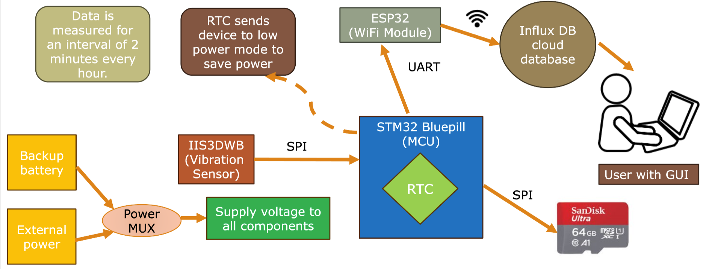

# Wireless Vibration Sensing for Structural Health Monitoring​

The below flowchart gives an overview of the entire design of this project:

## Scope for improvement

Following are some possible improvements in our project:

* The LSE of Bluepill wasn't functioning properly. Hence, RTC is being supplied with the LSI clock, which is inaccurate. If the device in use has a functioning LSE in its MCU, then instead supply that to the RTC.

* Writing to InfluxDB cloud-based database is slow. Currently, data is being acquired for intervals of 3 seconds following which the database takes around 5 seconds to write the data. Instead, data could be written at the end of the 2 minute run, before sending the MCU to STANDBY mode. This can be implemented by a handshake between MCU and ESP32 via UART, just before the STANDBY mode.

* The PCB design and connections for the accelerometer aren't correct (one of the GND pins isn't connected). Hence, corrections need to be made before using our PCB design. Also, add regulator for battery power input. Try incorporating the battery charger IC and if using 18650 batteries.

* Currently, no data interpretation/analysis is being performed on the acquired data. ML models can be deployed remotely to analyze the acquired data and accordingly signal in case of hazard.

